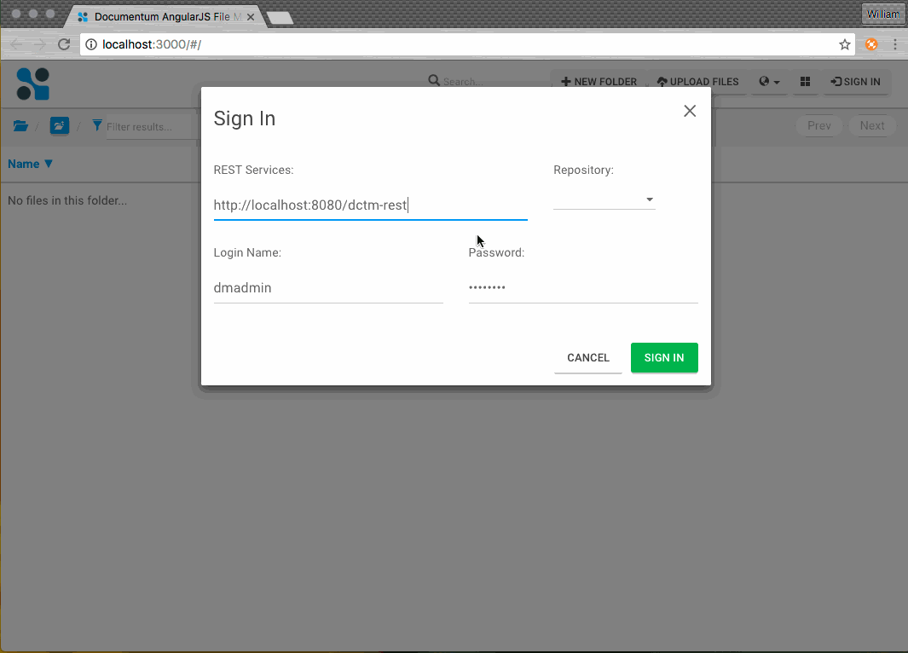

# Documentum REST Services Angular File Manager Sample

[](http://www.apache.org/licenses/LICENSE-2.0)


The project customizes [Angular File Manager](https://github.com/joni2back/angular-filemanager) to demonstrate the AngularJS application development for Documentum REST Services. 

Different with [Angular File Manager](https://github.com/joni2back/angular-filemanager),  we customized the API javascript in the project to make direct access to Documentum REST Services. This is more efficient with respect to the data transfer.

## 1. Project dependencies

* [NodeJS](https://nodejs.org/) is used to run the app on a server.
* [AngularJS](https://angularjs.org/) is used as the frontend framework.
* [Gulp](http://gulpjs.com/) jobs for development, building, emulating, running your app, compiles and concatenates Sass files, local development server with live reload.

##### Tip
>  You don't need to setup anything at this moment, please keep patience to follow next sections to install software.

## 2. Getting started

#### Preparation

* Assumed that you have Documentum Content Server 7.1+ up and running
* Enable [CORS](https://www.w3.org/TR/cors/) support in Documentum REST Services by customizing `dctm-rest.war\WEB-INF\classes\rest-api-runtime.properties`, update `dfc.properties` in the same directory and deploy the WAR.
```
#
# Copyright (c) 2016. Open Text Corporation. All Rights Reserved.
#

# Sets user defined runtime properties below. Settings in this file override the default ones defined in specific
# libraries. Please refer to file 'rest-api-runtime.properties.template' for available runtime configurations.

rest.cors.enabled=true
```

> CORS support is built into Documentum REST Services since 7.3. For previous versions, you need to seek an outside solution, for instance, [node-http-proxy](https://github.com/nodejitsu/node-http-proxy). Please read [Working-around-CORS](https://github.com/Enterprise-Content-Management/documentum-rest-client-angular-filemanager/wiki/Working-around-CORS) for the deployment on REST 7.2 and earlier versions.

#### Build and Run
* If you don't have [NodeJS](https://nodejs.org/) installed yet, download and install it.
> NodeJS 4.x is recommended. You might run into build errors using NodeJS 5.x.

* If you don't have [Git](https://git-scm.com/) installed yet, download and install it.
* If you don't have [bower](http://bower.io/) installed yet, run below CLI command to install it:
```bash 
> npm install -g bower
```
* If you don't have [gulp](http://gulpjs.com/) installed yet, run below CLI command to install it:
```bash
> npm install -g gulp
```
* Clone the project to you local workspace and navigate to the project home directory 
* Run below CLI commands in sequence to build the project:
```bash
> npm install --save-dev
> bower install
> gulp
```
* Run below CLI to start the SPA in a local web server (default port to 3000):
```bash
> gulp serve
```
Your web browser will be promoted to access the URL `http://localhost:3000`. If it did not get promoted, try to manually access this URL in your web browser.
> Goole Chrome and Mozilla Firefox are recommended. Microsoft Internet Explorer does not has the full support for HTML5 features demonstrated in this app.


## 3. Demo


## 4. Feature Overview
The sample application has a light API middleware [src/app/filemanager/services/filemanager.middleware.js](src/app/filemanager/services/filemanager.middleware.js) 
which calls [Documentum REST JavaScript client](src/app/filemanager/providers.client.js) to consume the REST services. 

### 4.1 Sign in and sign out
This sample application implements a very simple sign-in and sign-out process based on HTTP basic authentication. 

> Sample code in API middleware [src/app/filemanager/services/filemanager.middleware.js](src/app/filemanager/services/filemanager.middleware.js) 

```js
ApiMiddleware.prototype.login = function () {
    var loginInfo = {
    baseUri: fileManagerConfig.rootContext,
    repoName: fileManagerConfig.repositoryName,
    username: fileManagerConfig.username,
    password: fileManagerConfig.password
    }
    return dctmClient.login(loginInfo).then(function () {
    fileManagerConfig.signedin = true
    })
}

ApiMiddleware.prototype.logout = function () {
    return dctmClient.logout().then(function () {
    fileManagerConfig.signedin = false
    })
}
```

### 4.2 Content functions
This smaple application impelments below content operations:
* Folder navigation
* Create folder
* Import document
* Preview content 
* Download content 
* Edit textual content online 
* Rename
* Copy 
* Move 
* Delete
* Full-text search
* Pagination
* Permission management 

> Sample code in API middleware [src/app/filemanager/services/filemanager.middleware.js](src/app/filemanager/services/filemanager.middleware.js) 

```js
ApiMiddleware.prototype.listRootCabinets = function (pageNumber, itemsPerPage) {
    var repository = dctmClient.getCachedRepository()
    return dctmClient.getCabinets(repository,
    dctmConstants.QUERY_PARAMS.INLINE, true,
    dctmConstants.QUERY_PARAMS.PAGE, pageNumber,
    dctmConstants.QUERY_PARAMS.ITEMS_PER_PAGE, itemsPerPage)
}

ApiMiddleware.prototype.listFolderChildren = function (parent, pageNumber, itemsPerPage) {
    var viewAttrs = 'r_object_id,r_object_type,object_name,r_modify_date,r_creation_date,i_folder_id,r_full_content_size,a_content_type'
    return dctmClient.getChildObjects(parent,
    dctmConstants.QUERY_PARAMS.INLINE, true,
    dctmConstants.QUERY_PARAMS.VIEW, viewAttrs,
    dctmConstants.QUERY_PARAMS.PAGE, pageNumber,
    dctmConstants.QUERY_PARAMS.ITEMS_PER_PAGE, itemsPerPage)
}

ApiMiddleware.prototype.createFolder = function (parent) {
    var newFolder = { properties: { object_name: parent.name }}
    return dctmClient.createFolder(parent.object, newFolder)
}
```

### 4.3 Error handling
For an invalid operation, the error detail will be reported on the UI directly.


> Sample code at [src/app/filemanager/templates/modals.html](src/app/filemanager/templates/modals.html) 

```xml
<script type="text/ng-template" id="error-bar">
  <div class="label label-danger error-msg pull-left animated fadeIn" ng-show="apiMiddleware.error">
    <i class="glyphicon glyphicon-remove-circle"></i>
    <span>{{apiMiddleware.error}}</span>
  </div>
</script>
```
